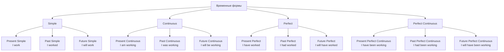

# ПОЛНАЯ ТАБЛИЦА ВРЕМЕН АНГЛИЙСКОГО ЯЗЫКА

## Активный залог (Active Voice)

## Пассивный залог (Passive Voice)

```mermaid
graph TD
    P[Пассивный залог] --> PS[Simple Passive]
    P --> PC[Continuous Passive]
    P --> PP[Perfect Passive]
    P --> PPC[Perfect Continuous Passive]
    
    PS --> PS1[Present Simple Passive<br/>It is done]
    PS --> PS2[Past Simple Passive<br/>It was done]
    PS --> PS3[Future Simple Passive<br/>It will be done]
    
    PC --> PC1[Present Continuous Passive<br/>It is being done]
    PC --> PC2[Past Continuous Passive<br/>It was being done]
    PC --> PC3[Future Continuous Passive<br/>It will be being done<br/>⚠️ очень редко]
    
    PP --> PP1[Present Perfect Passive<br/>It has been done]
    PP --> PP2[Past Perfect Passive<br/>It had been done]
    PP --> PP3[Future Perfect Passive<br/>It will have been done]
    
    PPC --> PPC1[Present Perfect Continuous Passive<br/>It has been being done<br/>⚠️ очень редко]
    PPC --> PPC2[Past Perfect Continuous Passive<br/>It had been being done<br/>⚠️ очень редко]
    PPC --> PPC3[Future Perfect Continuous Passive<br/>⚠️ практически не используется]
```

## Полная структурированная таблица

```mermaid
graph LR
    subgraph Active["АКТИВНЫЙ ЗАЛОГ"]
        direction TB
        A1[1. Present Simple<br/>I work<br/>work/works]
        A2[2. Past Simple<br/>I worked<br/>worked]
        A3[3. Future Simple<br/>I will work<br/>will work]
        
        A4[4. Present Continuous<br/>I am working<br/>am/is/are + V-ing]
        A5[5. Past Continuous<br/>I was working<br/>was/were + V-ing]
        A6[6. Future Continuous<br/>I will be working<br/>will be + V-ing]
        
        A7[7. Present Perfect<br/>I have worked<br/>have/has + V3]
        A8[8. Past Perfect<br/>I had worked<br/>had + V3]
        A9[9. Future Perfect<br/>I will have worked<br/>will have + V3]
        
        A10[10. Present Perfect Continuous<br/>I have been working<br/>have/has been + V-ing]
        A11[11. Past Perfect Continuous<br/>I had been working<br/>had been + V-ing]
        A12[12. Future Perfect Continuous<br/>I will have been working<br/>will have been + V-ing]
    end
    
    subgraph Passive["ПАССИВНЫЙ ЗАЛОГ"]
        direction TB
        P1[13. Present Simple Passive<br/>It is done<br/>am/is/are + V3]
        P2[14. Past Simple Passive<br/>It was done<br/>was/were + V3]
        P3[15. Future Simple Passive<br/>It will be done<br/>will be + V3]
        
        P4[16. Present Continuous Passive<br/>It is being done<br/>am/is/are being + V3]
        P5[17. Past Continuous Passive<br/>It was being done<br/>was/were being + V3]
        
        P6[18. Present Perfect Passive<br/>It has been done<br/>have/has been + V3]
        P7[19. Past Perfect Passive<br/>It had been done<br/>had been + V3]
        P8[20. Future Perfect Passive<br/>It will have been done<br/>will have been + V3]
    end
```

## Детальная таблица с формулами

```mermaid
flowchart TD
    Start[ВСЕ ВРЕМЕНА АНГЛИЙСКОГО ЯЗЫКА] --> Active[АКТИВНЫЙ ЗАЛОГ]
    Start --> Passive[ПАССИВНЫЙ ЗАЛОГ]
    
    Active --> SimpleA[PROSTЫЕ<br/>Simple]
    Active --> ContA[ПРОДОЛЖЕННЫЕ<br/>Continuous]
    Active --> PerfA[ЗАВЕРШЁННЫЕ<br/>Perfect]
    Active --> PerfContA[ЗАВЕРШЁННО-ПРОДОЛЖЕННЫЕ<br/>Perfect Continuous]
    
    SimpleA --> S1[Present: V/V-s]
    SimpleA --> S2[Past: V2/V-ed]
    SimpleA --> S3[Future: will + V]
    
    ContA --> C1[Present: am/is/are + V-ing]
    ContA --> C2[Past: was/were + V-ing]
    ContA --> C3[Future: will be + V-ing]
    
    PerfA --> P1[Present: have/has + V3]
    PerfA --> P2[Past: had + V3]
    PerfA --> P3[Future: will have + V3]
    
    PerfContA --> PC1[Present: have/has been + V-ing]
    PerfContA --> PC2[Past: had been + V-ing]
    PerfContA --> PC3[Future: will have been + V-ing]
    
    Passive --> SimpleP[PROSTЫЕ PASSIVE]
    Passive --> ContP[ПРОДОЛЖЕННЫЕ PASSIVE]
    Passive --> PerfP[ЗАВЕРШЁННЫЕ PASSIVE]
    
    SimpleP --> SP1[Present: am/is/are + V3]
    SimpleP --> SP2[Past: was/were + V3]
    SimpleP --> SP3[Future: will be + V3]
    
    ContP --> CP1[Present: am/is/are being + V3]
    ContP --> CP2[Past: was/were being + V3]
    
    PerfP --> PP1[Present: have/has been + V3]
    PerfP --> PP2[Past: had been + V3]
    PerfP --> PP3[Future: will have been + V3]
    
    style Start fill:#ff6b6b
    style Active fill:#4ecdc4
    style Passive fill:#ffe66d
    style SimpleA fill:#95e1d3
    style ContA fill:#f38181
    style PerfA fill:#a8e6cf
    style PerfContA fill:#ffaaa5
```

## Таблица в виде списка (для удобства копирования)

### АКТИВНЫЙ ЗАЛОГ (12 форм)

| № | Время | Формула | Пример |
|---|-------|---------|--------|
| 1 | **Present Simple** | V / V-s | I work / He works |
| 2 | **Past Simple** | V2 / V-ed | I worked / He worked |
| 3 | **Future Simple** | will + V | I will work |
| 4 | **Present Continuous** | am/is/are + V-ing | I am working / He is working |
| 5 | **Past Continuous** | was/were + V-ing | I was working / They were working |
| 6 | **Future Continuous** | will be + V-ing | I will be working |
| 7 | **Present Perfect** | have/has + V3 | I have worked / He has worked |
| 8 | **Past Perfect** | had + V3 | I had worked |
| 9 | **Future Perfect** | will have + V3 | I will have worked |
| 10 | **Present Perfect Continuous** | have/has been + V-ing | I have been working |
| 11 | **Past Perfect Continuous** | had been + V-ing | I had been working |
| 12 | **Future Perfect Continuous** | will have been + V-ing | I will have been working |

### ПАССИВНЫЙ ЗАЛОГ (10 основных форм)

| № | Время | Формула | Пример |
|---|-------|---------|--------|
| 13 | **Present Simple Passive** | am/is/are + V3 | It is done |
| 14 | **Past Simple Passive** | was/were + V3 | It was done |
| 15 | **Future Simple Passive** | will be + V3 | It will be done |
| 16 | **Present Continuous Passive** | am/is/are being + V3 | It is being done |
| 17 | **Past Continuous Passive** | was/were being + V3 | It was being done |
| 18 | **Present Perfect Passive** | have/has been + V3 | It has been done |
| 19 | **Past Perfect Passive** | had been + V3 | It had been done |
| 20 | **Future Perfect Passive** | will have been + V3 | It will have been done |

**Итого: 22 временные формы** (12 активных + 10 пассивных)

